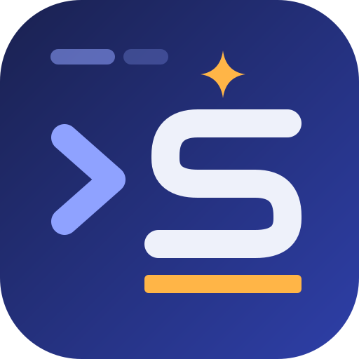
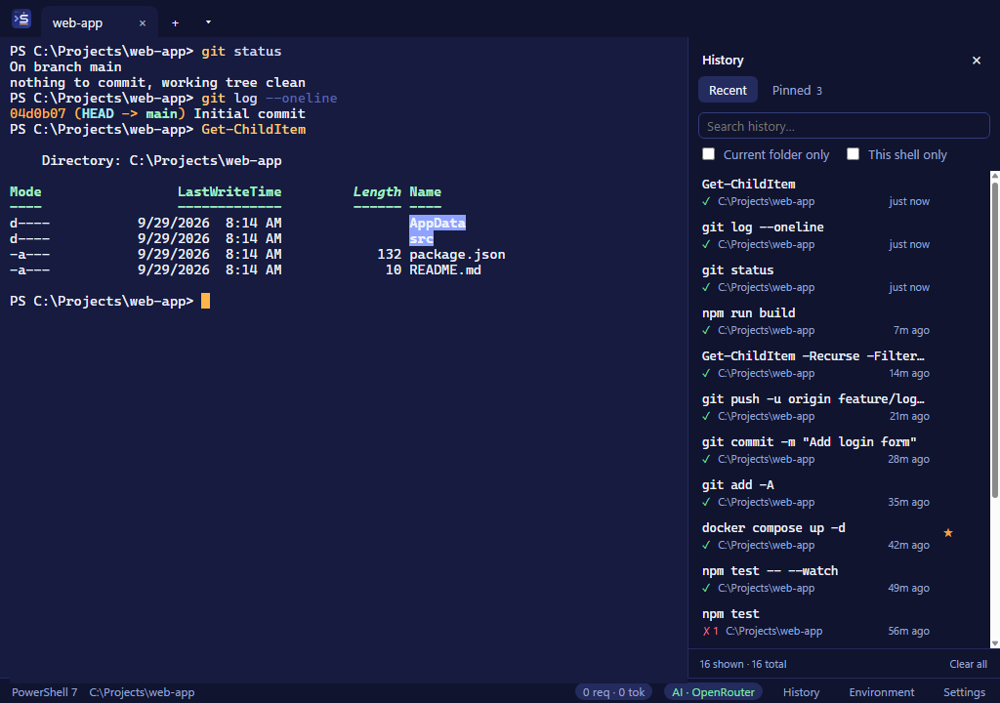
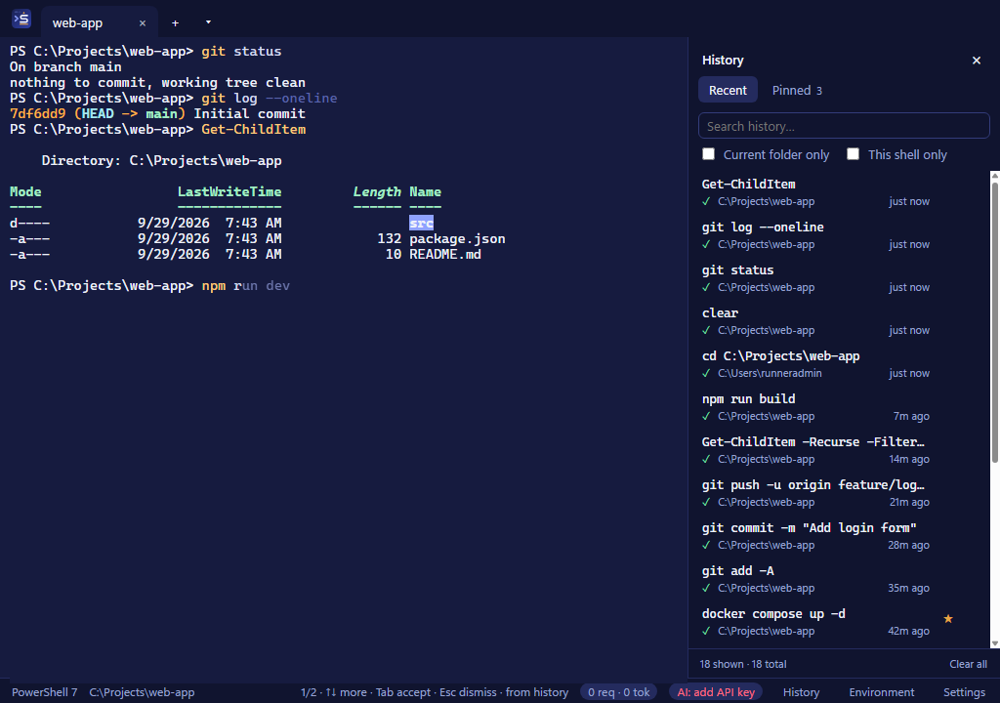
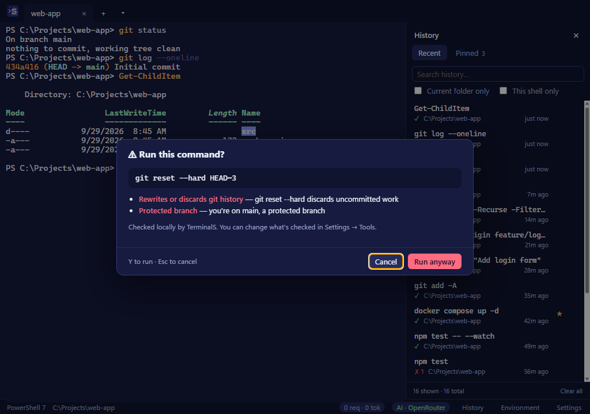
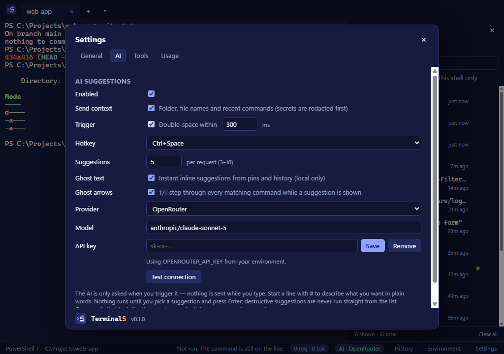
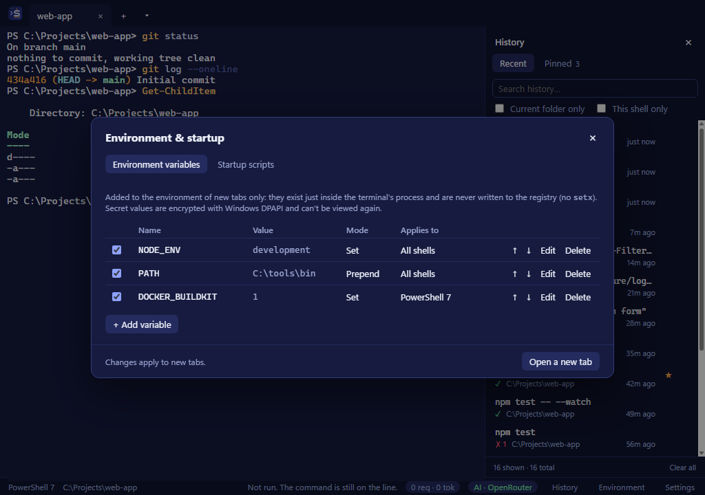

<p align="center">
  
</p>

<h1 align="center">TerminalS <sup>beta</sup></h1>

<p align="center">
  A Windows terminal with a searchable command history, inline suggestions and optional AI help.<br>
  Runs PowerShell, Command Prompt, Git Bash and WSL tabs.
</p>

<p align="center">
  <a href="https://github.com/avivmaman/TerminalS/actions/workflows/build.yml"></a>
  <a href="https://github.com/avivmaman/TerminalS/releases/latest"></a>
  
  <a href="LICENSE"></a>
</p>

<p align="center">
  
</p>

---

## Contents

- [Features](#features)
- [Screenshots](#screenshots)
- [Install](#install)
- [AI providers](#ai-providers)
- [Privacy](#privacy)
- [Shortcuts](#shortcuts)
- [How it works](#how-it-works)
- [Development](#development)
- [Contributing](#contributing)
- [License](#license)

## Features

**Terminal**
- Tabs for PowerShell 7, Windows PowerShell, Command Prompt, Git Bash and WSL (whichever are installed).
- Themes (including the **TerminalS** brand theme), font size and default shell in **Settings** (`Ctrl+,`).

**History and suggestions (local, no AI)**
- **History panel** (`Ctrl+Shift+H`): every command with its folder, time and exit code. Search it, filter to the current folder or shell, click to insert, double-click (or `Ctrl+Enter` in the search box) to run. Your PSReadLine history and Git Bash `~/.bash_history` are imported on first launch. Commands from one shell are suggested in others only when they work everywhere (`npm`, `git`, `docker`, … without shell-specific syntax such as `$env:` or `%VAR%`).
- **Pinned commands**: click ☆ on any history entry to pin it. Pins survive clearing history and come first in suggestions.
- **Ghost text**: grey inline completions from your pins and history. While one is shown, `↑`/`↓` step through every match, `Tab` or `→` accepts, `Esc` dismisses.
- **Safety guard**: pressing Enter on a risky command (recursive deletes, `git reset --hard`, force push, disk formatting, `DROP TABLE`, `kubectl delete`, `terraform destroy`, `curl … | sh`, …) asks first. Also warns about `git push`/`reset`/`rebase` on protected branches (`main`, `master` by default). Checked locally; nothing is sent.
- **Environment & startup** (`Ctrl+Shift+E`): environment variables (set / prepend / append, for all shells or one) and per-shell startup scripts, applied to new tabs only. Secret values are encrypted with Windows DPAPI and never shown again.

**AI tools (optional, bring your own key)**
- **Suggestion picker**: press **space twice** or **Ctrl+Space** for pinned/history matches plus 3–10 AI suggestions, each with a short note. Start the line with `#` to describe what you want in plain words. Destructive suggestions are flagged and never run straight from the picker.
- **Fix last command**: when a command fails, a **✦ Fix** chip appears on the prompt; click it or press **Alt+F**. The last lines of output (redacted) can be included.
- **Translate between shells**: paste a bash command into PowerShell (or the other way round) and TerminalS offers to translate it; **Alt+T** translates the current line. Common one-liners are translated by built-in rules without AI.
- **Usage meter**: requests, tokens and estimated cost per day (counts only, never content), with optional daily caps.
- **AI-excluded folders**: no AI requests of any kind from these folders or their subfolders.

Every AI tool can be switched off in **Settings → Tools**.

## Screenshots

| | |
|---|---|
|  |  |
| **Ghost text** from your history and pins | **Safety guard** before a risky command |
|  |  |
| **Settings** with the AI provider | **Environment & startup** manager |

Screenshots are generated by the [Screenshots workflow](.github/workflows/screenshots.yml) on a Windows runner (`scripts/screenshots.js`).

## Install

> [!IMPORTANT]
> TerminalS is in **beta**. Expect rough edges, and please [report issues](https://github.com/avivmaman/TerminalS/issues).

Download the latest build from [Releases](https://github.com/avivmaman/TerminalS/releases) (beta builds are marked *Pre-release*):

- `TerminalS-Setup-<version>.exe`: installer (per-user, no admin needed). **Updates itself.**
- `TerminalS-<version>-portable.exe`: single file, no install. Tells you when a new version is out, but you download it yourself.

### Updates

The installed app checks GitHub Releases at start-up and every few hours. A new version downloads in the background; click **Restart to update** in the status bar (or **Settings → General → Updates**) to install it. Beta builds receive newer betas and stable releases; stable builds receive stable releases only. Automatic checks can be turned off in Settings, and **Check now** checks on demand. The check is a plain request to GitHub; no usage data is sent.

Builds for every push are also attached to the [Build workflow](https://github.com/avivmaman/TerminalS/actions/workflows/build.yml) runs as artifacts.

> [!NOTE]
> The executables are not code-signed yet, so Windows SmartScreen may warn on first launch (**More info → Run anyway**). Machines with application control (AppLocker/WDAC) may block unsigned apps entirely; see [Code signing](#code-signing).

Requires Windows 10 1809 or later (ConPTY).

## AI providers

AI features are optional. Pick a provider in **Settings → AI** and add a key there (stored encrypted with DPAPI) or through an environment variable.

| Provider | Configure | Key |
|---|---|---|
| **Claude API** (Anthropic) | Model: `claude-opus-5` (default), `claude-sonnet-5`, `claude-haiku-4-5` (lowest latency) | `ANTHROPIC_API_KEY` |
| **OpenRouter** | Any [OpenRouter model](https://openrouter.ai/models) slug, e.g. `anthropic/claude-opus-5`, `openai/gpt-5`, `google/gemini-2.5-flash` | `OPENROUTER_API_KEY` |
| **Claude on Azure AI Foundry** | Resource name or `https://…services.ai.azure.com/anthropic/` URL, model/deployment | `ANTHROPIC_FOUNDRY_API_KEY` (+ `ANTHROPIC_FOUNDRY_BASE_URL`) or Entra ID |
| **Azure OpenAI** | Endpoint, deployment, API version (default `2024-10-21`) | `AZURE_OPENAI_API_KEY` (+ `AZURE_OPENAI_ENDPOINT`) or Entra ID |

- Azure providers can sign in with an API key or **Entra ID** (`DefaultAzureCredential`: `az login`, Azure PowerShell, managed identity), which uses short-lived tokens instead of long-lived keys.
- Azure endpoints must be `https://` on an Azure AI domain. A key taken from an environment variable is only ever sent to the endpoint from the matching environment variable.
- OpenRouter reports the actual cost of each request, so the usage meter shows real spend for it. Claude models show an estimate from list prices; Azure OpenAI shows none.
- **Test connection** in Settings sends a fixed synthetic prompt (`git st`) with no context.

## Privacy

- Nothing is sent to any AI service while you type. Requests happen only when you open the picker, click Fix or translate.
- What is sent: the typed prefix, the shell name and, if **Send context** is on, the current folder, its file names and your last 20 commands. Everything goes through [`src/main/redact.js`](src/main/redact.js) first; if the input itself looks like a credential, no request is made.
- Terminal state is sent as JSON data, separate from the instructions, and replies are validated (single line, no control characters).
- Commands that look like they contain credentials are never saved to history.
- Everything is stored locally under `%APPDATA%\TerminalS\`:
  - `settings.json`, `profiles.json`, `history.json`, `pins.json`, `usage.json` (daily counters only)
  - `secrets.json`: DPAPI-encrypted secret variables and API keys
  - `startup-scripts\`: the generated startup script files

## Shortcuts

| Keys | Action |
|---|---|
| `Ctrl+Shift+T` / `Ctrl+Shift+1..9` | New tab (same shell / specific shell) |
| `Ctrl+Shift+W` | Close tab |
| `Ctrl+Tab` / `Ctrl+Shift+Tab` | Next / previous tab |
| `Ctrl+Shift+H` | Toggle history panel |
| `Ctrl+Shift+E` | Environment & startup manager |
| `Ctrl+,` | Settings |
| Space Space / `Ctrl+Space` | AI suggestion picker (configurable) |
| `Alt+F` | Fix last failed command (configurable) |
| `Alt+T` | Translate the line to this tab's shell (configurable) |
| `Ctrl+C` (with selection) / `Ctrl+Shift+C` | Copy |
| `Ctrl+V` / right-click | Paste (right-click copies when text is selected; configurable) |
| `F12` | DevTools |

In the picker: `↑↓` select, `Enter`/`Tab` insert, `1`–`9` quick pick, `Ctrl+Enter` insert and run, `Esc` close.

## How it works

TerminalS is an [Electron](https://www.electronjs.org/) app using [xterm.js](https://xtermjs.org/) for rendering and [node-pty](https://github.com/microsoft/node-pty) (ConPTY) for the shells.

Each shell is started with a small integration script ([`src/main/shell-integration/`](src/main/shell-integration)) that wraps the prompt to emit OSC 633 markers, the same protocol VS Code uses, for prompt start, input start, exit code and current directory. The terminal reads the command line straight from the screen buffer between the input-start marker and the cursor, so suggestions stay correct after tab completion, history recall and in-line edits. WSL has no integration yet and falls back to a heuristic.

The PowerShell integration is dot-sourced via `-Command`, so a machine-wide execution policy that blocks scripts disables integration (the shell still works, without folder tracking, exit codes and reliable suggestions).

```
src/
  main/         Electron main process: shells (pty.js), AI (ai.js), history, settings, safety guard, translation
  renderer/     UI: tabs, history panel, picker, dialogs
  preload.js    The IPC bridge between the two
test/           Unit tests (plain Node, no framework)
scripts/        Icon generation and README screenshots
```

## Development

Requires Windows, [Node.js](https://nodejs.org/) 22+ and Git.

```powershell
git clone https://github.com/avivmaman/TerminalS.git
cd TerminalS
npm install
npm start
```

| Command | What it does |
|---|---|
| `npm start` | Run the app |
| `npm run check` | Syntax-check the sources and run the unit tests (redaction, suggestion parsing, safety guard, shell translation) |
| `npm run dist` | Build `dist\TerminalS-Setup-<version>.exe` and `dist\TerminalS-<version>-portable.exe` |
| `npm run dist:dir` | Build `dist\win-unpacked\TerminalS.exe` only (fastest) |
| `npm run icons` | Regenerate `assets/icon.ico` and `assets/icon.png` from `assets/icon.svg` |

Builds use electron-builder (config under `"build"` in `package.json`). node-pty's prebuilt Windows binaries are used as-is, so Visual Studio isn't needed. The shell-integration scripts and node-pty are unpacked from the asar archive because the shells and ConPTY must read them from disk.

### Releases

The [Build workflow](.github/workflows/build.yml) runs `npm run check` and builds both executables on every push and pull request.

Every push to `main` also publishes a GitHub release named after the version in `package.json`, with the executables and the update files (`*.yml`, `*.blockmap`) the in-app updater reads. Versions with a pre-release part, such as `0.2.0-beta.1`, are published as **pre-releases** titled "(Beta)". If that version is already released, the step is skipped, so bump the version to ship a new one:

```powershell
npm version prerelease --preid beta --no-git-tag-version   # 0.2.0-beta.1 -> 0.2.0-beta.2
npm version minor --no-git-tag-version                     # 0.2.0-beta.2 -> 0.2.0 (first stable)
git commit -am "Release 0.2.0-beta.2"
git push
```

Pushing a `v*` tag publishes a release for that tag as well.

### Code signing

The executables are unsigned. To sign them, give electron-builder a certificate through the `CSC_LINK` / `CSC_KEY_PASSWORD` environment variables (in CI, from repository secrets; never commit them), or use Azure Trusted Signing (`build.win.azureSignOptions`). Unsigned builds on machines with application control can also fail with `spawn EPERM`, because electron-builder runs the generated uninstaller while building.

## Contributing

Issues and pull requests are welcome.

1. Fork the repository and create a branch.
2. Make your change; keep it focused and match the surrounding code style.
3. Run `npm run check` and try the change in the app with `npm start`.
4. Open a pull request describing what changed and why.

For bugs, include your Windows version, the shell, and steps to reproduce. Please don't include API keys, command output with secrets, or the contents of `%APPDATA%\TerminalS\secrets.json`.

By contributing, you agree that your contribution is licensed under the same terms as the project.

## License

TerminalS is free for noncommercial use under the [PolyForm Noncommercial License 1.0.0](LICENSE).

- **Allowed:** personal use, study, research, hobby projects, and use by charities, schools, public research organisations and government institutions. You may modify the code and share it (including modified versions) for these purposes, keeping the license and the copyright notice.
- **Not allowed:** any commercial use, such as use by or inside a business, or selling, bundling or offering it as part of a paid product or service.

For commercial use, [open an issue](https://github.com/avivmaman/TerminalS/issues) to ask about a commercial license.

This is a source-available license, not an OSI-approved open-source license.
